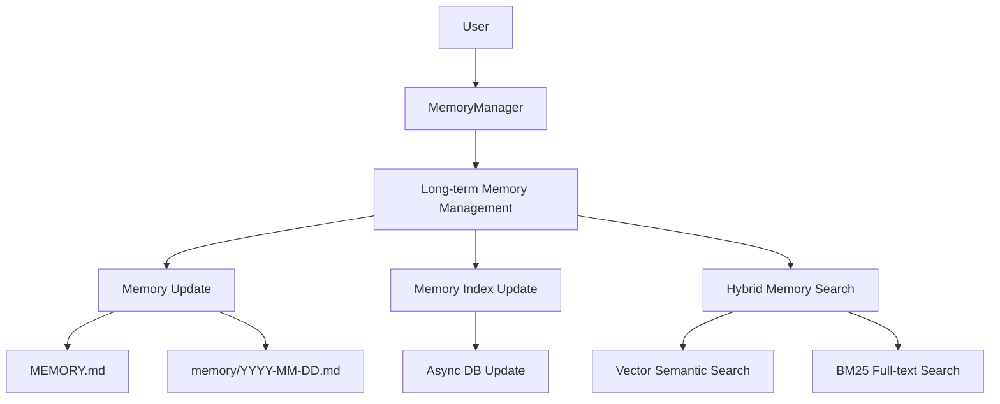

# CoPaw Memory System

## Overview and Role
CoPaw implements a **Long-term Memory** system providing persistent memory across conversations. It uses a file-backed approach where memory constitutes readable, editable Markdown files. This allows semantic retrieval, persistent decision context, and transparent developer verification. The system is fundamentally inspired by ReMe (and specifically implements `ReMeLight`), focusing on local privacy, direct agent edibility, and dual vector/BM25 retrieval.

## Architecture Integration
CoPaw's architecture encapsulates long-term memory via the `MemoryManager` module which is composed within the Agent runtime layer.

## Key Files, Modules, and Classes
- **`src/copaw/agents/memory/reme_light_memory_manager.py`**: A wrapper for the external `reme-ai` library. Unifies compaction (`compact_tool_result`, `compact_memory`), summarization logic (`summary_memory`), and provides high-level `memory_search()`.
- **`src/copaw/agents/memory/base_memory_manager.py`**: Abstract memory implementation.
- **`src/copaw/agents/tools/read_file.py` and `write_file.py` / `edit_file.py`**: The file-system tools given to the Agent, forming the primary interaction proxy.
- **`website/public/docs/memory.en.md`**: Foundational memory documentation.

## Data and Control Flow
1. **Creation/Writing**: When an agent detects a persistent fact or ends a sprint layer, it invokes file tools (`write_file`, `edit_file`) directly on `MEMORY.md` or `memory/YYYY-MM-DD.md`.
2. **Indexing**: A background `Watcher` (`rebuild_memory_index_on_start` or dynamic tailing) indexes modifications.
3. **Retrieval**: 
   - **Semantic Search**: Driven by vector embeddings (e.g., OpenAI, vLLM models using `cosine similarity`).
   - **Full-text Search (BM25)**: Ensures exact-match keyword recall.
   - **Hybrid Fusion**: Both vectors merge via a weighted algorithm (`score = vector * 0.7 + bm25 * 0.3`) across document chunks.
4. **Resolution**: The `memory_search` component formats these chunk hits into snippets the LLM Agent natively reads as observations.
