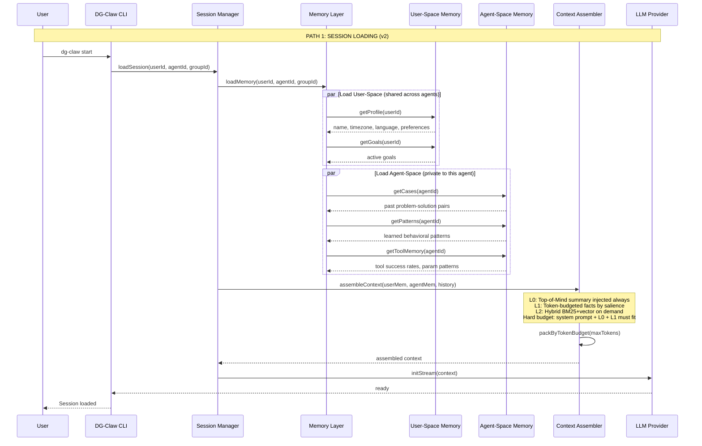
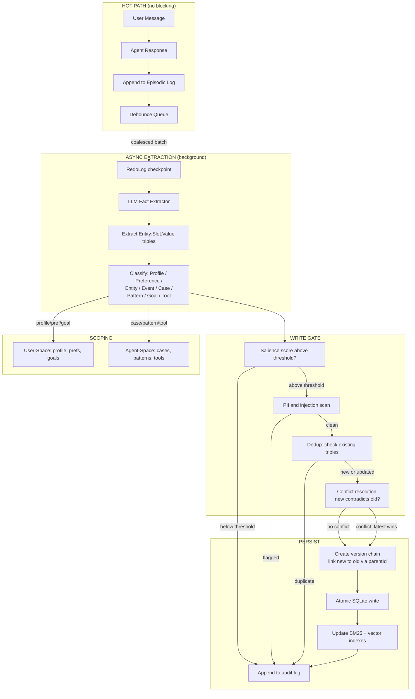
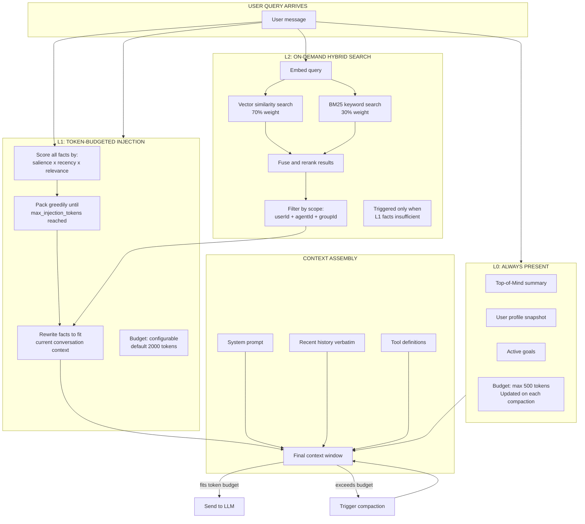
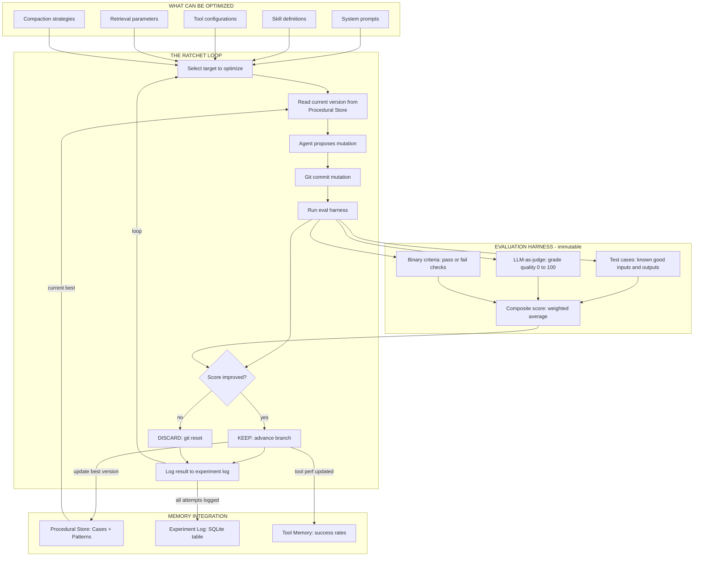
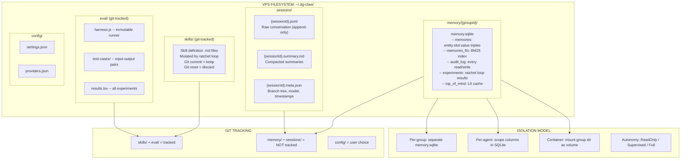

# DG-Claw Memory Layer -- Architecture Diagrams

Companion to `2026-03-28-memory-layer-design.md`. All diagrams in Mermaid format with edit links.

---

## Path 1 v2: Session Loading

[Edit in Mermaid](https://l.mermaid.ai/EMBZGc)

---

## Path 2 v2: Write Path (User Journey + Extraction)

[Edit in Mermaid](https://l.mermaid.ai/swULcP)

---

## Path 3 v2: Read Path (Tiered Retrieval)

[Edit in Mermaid](https://l.mermaid.ai/E4CBOA)

---

## Path 4 v2: Memory Tiers with Salience Decay

[Edit in Mermaid](https://l.mermaid.ai/riJ0zE) (v1 -- conceptually unchanged, salience added)

```mermaid
flowchart LR
    subgraph TIER1 ["TIER 1: Working Memory"]
        direction TB
        W1[Current context window]
        W2[Last ~20 messages verbatim]
        W3[Active tool results]
        W4[L0 Top-of-Mind + L1 facts]
        W5["Lifetime: THIS TURN"]
        W6["Storage: RAM only"]
        W7["Budget: token-limited"]
    end

    subgraph TIER2 ["TIER 2: Session Memory"]
        direction TB
        S1[Full conversation JSONL]
        S2[Compacted summaries .md]
        S3[Session metadata .json]
        S4[Branching tree state]
        S5["Lifetime: THIS SESSION"]
        S6["Storage: JSONL on disk"]
        S7["Size: unbounded"]
    end

    subgraph TIER3 ["TIER 3: Long-Term Memory"]
        direction TB
        L1a[Entity:Slot:Value triples]
        L2a[8 typed categories]
        L3a[Version chains via parentId]
        L4a[Salience scores with decay]
        L5["Lifetime: PERMANENT"]
        L6["Storage: SQLite + FTS5 + vectors"]
        L7["Scope: userId x agentId x groupId"]
    end

    subgraph FLOWS ["DATA FLOWS"]
        direction TB
        F1["COMPACTION: Working --> Session<br/>ContextChecker triggers Compactor<br/>Structured summary archived"]
        F2["EXTRACTION: Session --> Long-Term<br/>Async LLM extracts triples<br/>Write gate filters before persist"]
        F3["RETRIEVAL: Long-Term --> Working<br/>L0 always, L1 by salience budget<br/>L2 hybrid search on demand"]
        F4["DECAY: salience *= 0.95 per cycle<br/>Reinforcement on access<br/>Archive below threshold 0.05"]
    end

    TIER1 -->|compaction| TIER2
    TIER2 -->|extraction| TIER3
    TIER3 -->|retrieval| TIER1
    TIER3 -->|decay| TIER3
```

---

## Path 5 v2: Auto-Learning Ratchet Loop

[Edit in Mermaid](https://l.mermaid.ai/bB5dfd) (v1 -- conceptually unchanged)

---

## Path 6 v2: Files on Disk

[Edit in Mermaid](https://l.mermaid.ai/v1S64M) (v1 -- updated with per-group isolation)

---

## Original v1 Diagrams (for reference)

### Path 1 v1: Session Loading
[Edit](https://l.mermaid.ai/vHOcIk)

### Path 2 v1: User Journey
[Edit](https://l.mermaid.ai/LHsS9r)

### Path 3 v1: Model Interaction
[Edit](https://l.mermaid.ai/SxfYJw)

### Path 4 v1: Memory Tiers
[Edit](https://l.mermaid.ai/riJ0zE)

### Path 5 v1: Auto-Learning Ratchet
[Edit](https://l.mermaid.ai/bB5dfd)

### Path 6 v1: Files on Disk
[Edit](https://l.mermaid.ai/v1S64M)
